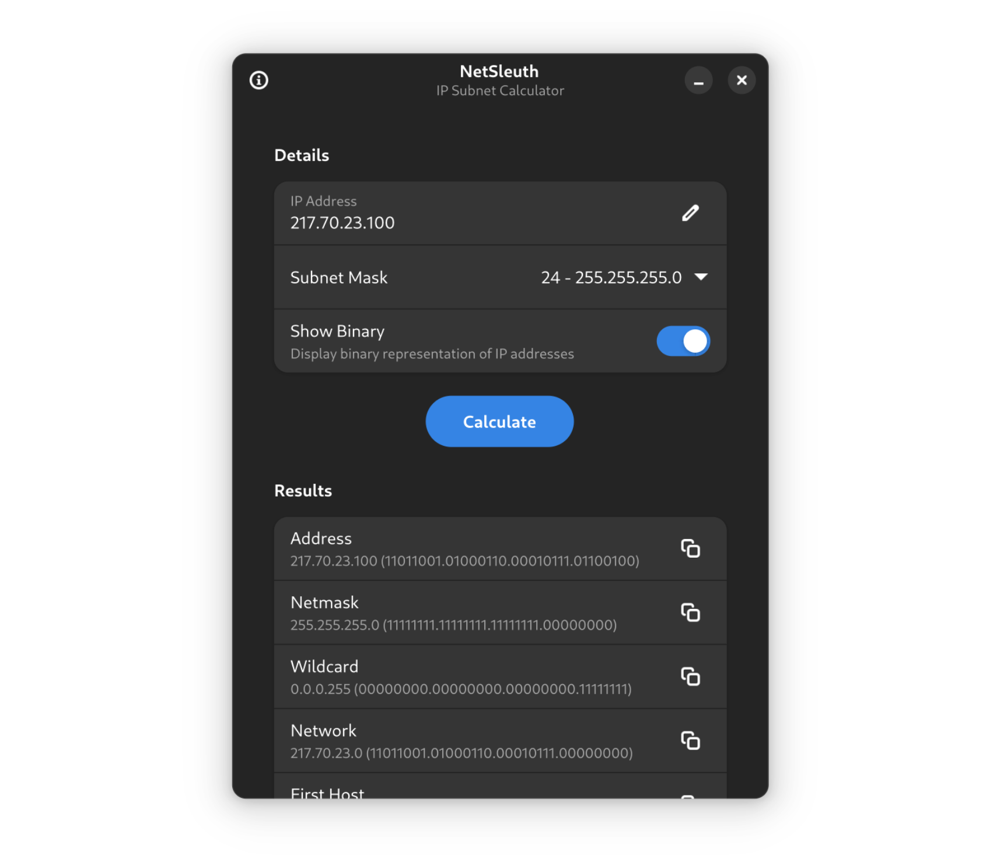

# Netsleuth

_Netsleuth_ is a simple utility for calculating and analyzing an IP subnet values.

## Building from source

### GNOME Builder

The recommended method is to use GNOME Builder:

1. Install [`org.gnome.Builder`](https://gitlab.gnome.org/GNOME/gnome-builder) from Flathub.
2. Open Builder and select `Clone Repository`.
3. Clone `https://github.com/vmkspv/netsleuth.git`.
4. Press `Run Project` at the top once project is loaded.

### Flatpak

You can also build the actual code as Flatpak:

1. Install [`org.flatpak.Builder`](https://github.com/flatpak/flatpak-builder) from Flathub.
2. Clone `https://github.com/vmkspv/netsleuth.git` and `cd netsleuth`.
3. Run `flatpak run org.flatpak.Builder --install --user --force-clean build-dir io.github.vmkspv.netsleuth.json`.

## Contributing

Contributions are welcome!

If you have an idea, bug report or something else, don’t hesitate to [open an issue](https://github.com/vmkspv/netsleuth/issues).

> This project follows the [GNOME Code of Conduct](https://conduct.gnome.org).

## License

Netsleuth is released under the [GPL-3.0 license](COPYING).
